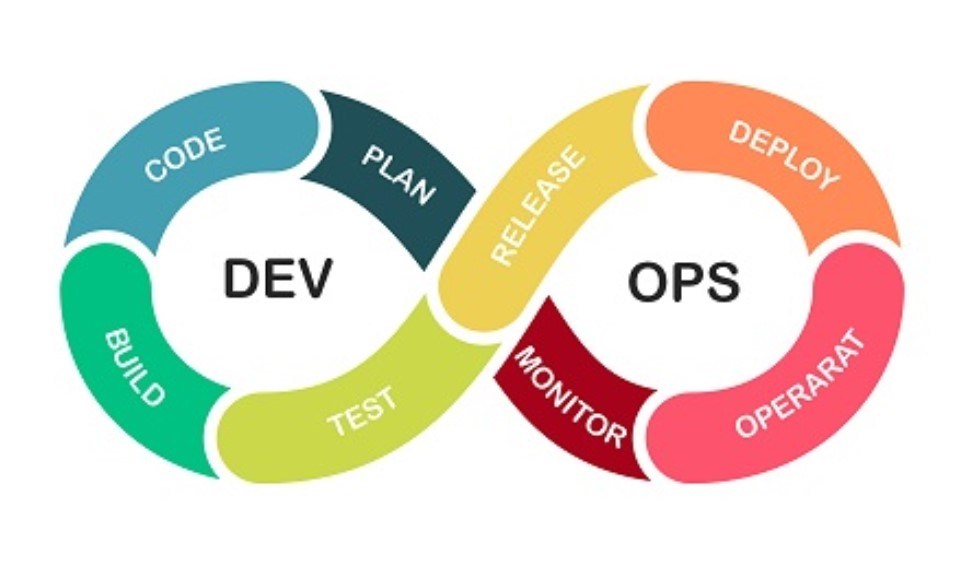
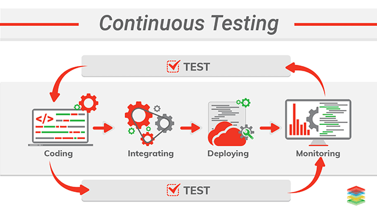
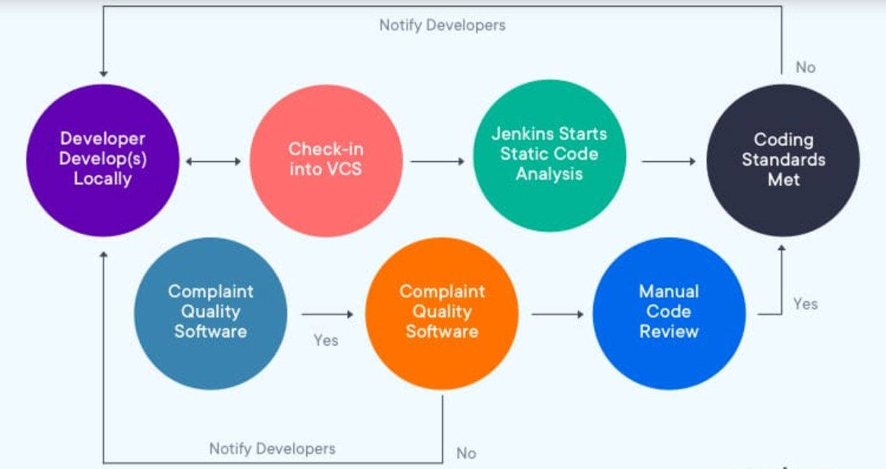

## Overview

**DevOps** speeds up your procedures and makes them **progressively effective**, however, organizations must concentrate on **quality** just as speed. QA ought not to live outside the DevOps condition, it ought to be a principal part. If your DevOps desire has begun with just the turn of events and **tasks groups**, it's not very late to circle in testing. You should incorporate QA into the lifecycle to genuinely accomplish **DevOps benefits**.

## What is Continuous Testing?
**Continuous Testing** is characterized as a product testing type that includes a procedure of testing **early, testing regularly, test all over, and automation**. It is a technique of assessing **quality** at each progression of the **Continuous Delivery** Process. The objective of Continuous Testing is to test early and test regularly. The procedure includes partners like **Developer**, **DevOps**, **QA** and **Operational framework**.

## How to do Continuous Testing?
-  Generate **automation** suite from person **stories/requirements** using some tools.
- Create **Test Environment**.
- Copy and anonymize **production facts** to create check statistics bed
- Use service **virtualization** to test API.
- Parallel overall **performance testing**.

## DevOps Need in Continuous Testing

The **adoption** of **DevOps** practices is **dramatically increasing** for the duration of many specific industries, mostly due to groups spotting the **numerous benefits DevOps** can deliver.

**DevOps** does **accelerate** your procedures and make them **extra efficient,** but businesses that completely **consciousness** on speed and ignore **first-class factors** are in all likelihood to go through a massive blow. Teams must awareness first on first-rate by lowering **defects and bugs** before running on rushing up their operations.

**Integrating QA** inside **DevOps** additionally performs an essential role in managing dangers by making sure the utility is **robust** and stable during the **improvement** system. **Continuous testing** as a part of a **DevOps** approach facilitates **detect bugs quickly**, when they're easier and **less costly** to fix, ensuring your application is fit for utilization and enhancing an awesome **consumer experience**.

**QA** must not stay outdoor the **DevOps environment**, it needs to be a fundamental part. But if your **DevOps ambitions** have begun with most **effective** the **development** and **operations** teams, it is no longer too late to **loop** in testing. You should **combine QA **into the lifecycle to truly attain **DevOps benefits.**

## Advantages of Continuous Testing

- **Speedup** the software delivery.
- Continuous testing **improves code quality**.

- It assists with **surveying** definite **business hazard** inclusion.

- It **consistently** incorporates into **DevOps** Process.

- Assists with making a nimble and **dependable** procedure are not more than hours rather than months.

- **Accelerates** time-to-showcase with a **continuous** criticism component.

- Unions customarily siloed groups to meet present-day **undertaking needs**. Breaks down separate between **improvement**, **testing**, and **tasks groups**.

- Test **Automation** assists with accomplishing consistency by keeping up a similar arrangement for every single **important test**.

- **Emphasizes** business desires to alleviate business dangers.

- Furnishing omnipresent test condition access with **Service Virtualization**.

## Difficulties of Continuous Testing

- The **traditional manner** is limiting cultural shift among **Development** & **QA** professionals.

- Lack of **DevOps** competencies and proper tools for **testing in Agile** & **DevOps** environments.

- **Heterogeneous** check **environments** which will in no way replicate the production environment.

- The conventional testing manner and loosely defined check** statistics management**.

- Longer code **integration cycles** create integration issues and past due disorder fixes.

- **Insufficient** and **ineffective** resources and take a look at **environments**.

- Complex application **structure** and business logic that restricts **DevOps adoption**.

## Conclusion

- In **Software Engineering**, **Continuous testing** is a procedure of **testing early**, testing **regularly**, testing all over, and **computerize**.

- The old method of testing was a **handoff driven**. The product is given off starting with one group then onto the next.

- **Jenkins**, **Travis**, and **Selenium** are mainstream **Continuous Testing** and **Integration tools**.

- Continuous Testing conveys** significant criticism** as indicated by each phase of the conveyance **pipeline**.

- Continuous testing assists with **improving code quality**.

- The customary procedure is constraining social move among **Development** and **QA experts**.

- Longer code mix cycles make **incorporation** issues and late **defect fixes**.
