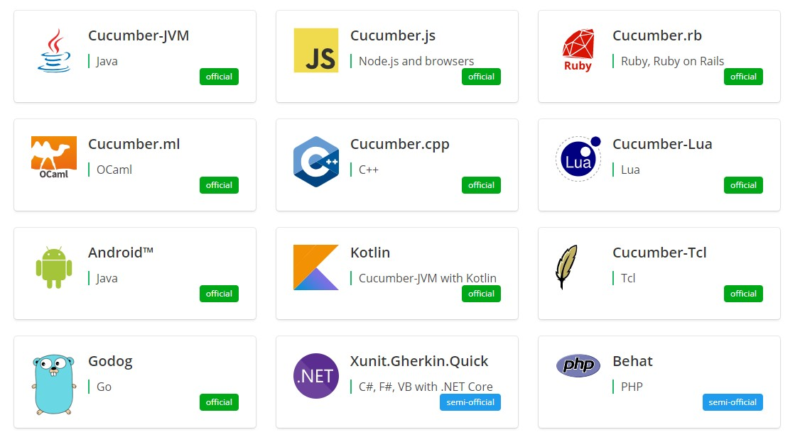
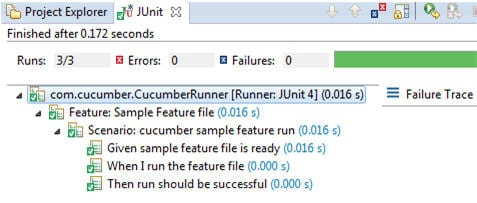

> **Cucumber** is a tool that supports **Behaviour-Driven Development(BDD)**. If you are very new to Behaviour-Driven Development read our **BDD** introduction first.

## What is Behaviour-Driven Development(BDD)
**BDD**  is a way for software groups to paintings that closes the space between **commercial enterprise people** and **technical people** by:
- Encouraging collaboration **throughout**  roles to **construct** a shared know-how of the **problem** to be solved.
- Working in rapid, small iterations to **increase comments** and the go with the flow of value.
- Producing device **documentation** that is **robotically** checked towards the system's behavior.

## What is Cucumber
**Cucumber** reads executable specs written in **undeniable textual content** and validates that the software program does what those **specifications say**. The specifications consist of more than one example or scenario.

```
Feature: Login Feature File
@selenium
Scenario: Login scenario test for Gmail

Given navigate to Gmail page
When user logged in using the username as “userA” and password as “password”
Then the home page should be displayed
```
Each scenario is a list of steps for **Cucumber** to paintings through. **Cucumber** verifies that the software program conforms with the specification and generates a record indicating ✅ **success** or ❌ **failure** for each scenario.

> For Cucumber to **apprehend** the scenarios, they have to follow **some fundamental syntax** rules, called **Gherkin**.

## What is Gherkin
**Gherkin** is hard and fast of **grammar** policies that make simple text structured enough for **Cucumber to understand.** The scenario above is written in Gherkin.

**Gherkin** is the layout for **cucumber specifications**. It is a domain precise language which helps you to describe **business behavior** without the want to go into element of **implementation**. This text acts as **documentation** and skeleton of your automatic tests.
>**Gherkin** generally user for two primary purposes:

- Writing an automated test (BDD)
- Documents user scenarios

**Gherkin** documents are stored in `.feature` file format.

##Cucumber Installation
**Cucumber** is to be had for most mainstream programming languages. We recommend selecting an implementation for the **same platform or programming language** as the **production code**.

> Download **Cucumber** from the following link: https://cucumber.io/docs/installation/


> In this blog we are using the **Cucumber JVM** with Maven in **Eclipse** IDE

##Cucumber Project Setup
- **Create a New Maven Project:**
File -> New -> Others -> Maven -> Maven Project 
- **Add below dependencies in pom.xml**
```xml
<dependencies>
<dependency>
      <groupId>info.cukes</groupId>
      <artifactId>cucumber-java</artifactId>
      <version>1.0.2</version>
      <scope>test</scope>
  </dependency>
<dependency>
     <groupId>info.cukes</groupId>
     <artifactId>cucumber-junit</artifactId>
     <version>1.0.2</version>
     <scope>test</scope>
</dependency>
<dependency>
     <groupId>junit</groupId>
     <artifactId>junit</artifactId>
     <version>4.10</version>
     <scope>test</scope>
</dependency>
</dependencies> 
```
- **Create a `sample.feature` file under src/test/resources.**
    ```
    @smokeTest
    Feature: To test my cucumber test is running
    I want to run a sample feature file.
    
    Scenario: cucumber setup
    
    Given sample feature file is ready
    When I run the feature file
    Then run should be successful
    ```
- **Create a `class` under src/test/java which will implement all the steps.**
```java
public class stepDefinition {
       @Given("^sample feature file is ready$")
       public void givenStatment(){
              System.out.println("Given statement executed successfully");
       }
       @When("^I run the feature file$")
       public void whenStatement(){
              System.out.println("When statement execueted successfully");
       }
       @Then("^run should be successful$")
       public void thenStatment(){
              System.out.println("Then statement executed successfully");
       }
}
```
- **Create a JUnit runner to run the test.**
```java
@RunWith(Cucumber.class)
@Cucumber.Options(format={"pretty","html:reports/test-report"},tags= "@smokeTest")
public class CucumberRunner {
}
```
>Provide the **path** of the **report** as given here. The **reports** will store in ‘**test-report**’ folder under project folder and “**pretty**” format specifies the type of report.

- **Junit Result and Test Report:**
The report when the cucumber test is successful. The **Green** bar in Junit describes the test is passed. Similarly, **Red** bar describes that test has failed.



##Cucumber Selenium WebDriver Integration
**Cucumber** framework may be used to test the **web-based applications** in conjunction with** Selenium WebDriver**. The check instances are written in easy feature files which are easily understandable by the **managers**, non-technical **stakeholders** and **business analysts**. If you are the user of maven then you have to add dependencies for **Cucumber and WebDriver**.

> So right here is the sample test case we have applied the use of Cucumber and WebDriver. As given below, the situation in the feature record is self-explanatory.

    Feature: Login Feature File
    @selenium
    Scenario: Login scenario test for Gmail
    
    Given navigate to Gmail page
    When user logged in using the username as “userA” and password as “password”
    Then the home page should be displayed

```java
public class stepDefinition {
WebDriver dr;
@Given("^navigate to gmail page$")
public void navigate(){
       dr=new FirefoxDriver();
       dr.get("http://www.gmail.com");         
       }
@When ("^user logged in using username as \"(.*)\" and password as \"(.*)\"$")
public void login(String username,String password){
       dr.findElement(By.xpath("//*[@id='Email']")).sendKeys(username);
       dr.findElement(By.xpath("//*[@id='Passwd']")).sendKeys(password);
       dr.findElement(By.xpath("//*[@id='signIn']")).click();
       dr.manage().timeouts().implicitlyWait(20, TimeUnit.SECONDS);
       }
@Then("^home page should be displayed$")
public void verifySuccessful(){
      String expectedText="Gmail";
      String actualText=         dr.findElement(By.xpath("//*[@id='gbq1']/div/a/span")).getText();
      Assert.assertTrue("Login not successful",expectedText.equals(actualText));
      }
}
```
- **Given** statement initializes the browser and navigates to the page.
- **When** statement logs into the application using the username as “userA” and password as “password”. Both the values ‘username’ and ‘password’ are passed from feature file and both the values to be used in the same order.
- **Then** Statement only validates the conditions after logging into the application.

## Conclusion
In this **Cucumber** Selenium Java Integration Blog, we have covered most ideas about Cucumber functions and its usage alongside WebDriver.

This reduces the **complexity** of code which is written to design the **traditional frameworks** like **Keyword Driven** and **Hybrid Framework**. Cucumber is used in most of the project where **agile methodology** is used as **Behavior Driven Development** is an Agile Software practice..

