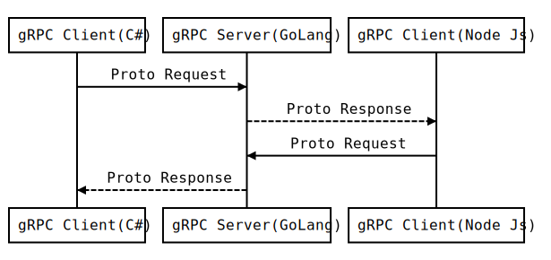

####**What is gRPC?**

**gRPC** is a modern, open-source remote procedure call (RPC) framework that can run anywhere. It enables client and server applications to communicate transparently and makes it easier to build connected systems. It is a Remote Procedure call provided by Google which defines a service calling methods on a remote server. Some advantages of gRPC are; it supports multiple languages and has high performance compared to regular RPC services.
####**Below UML Diagram defines Language-Independent Model:**

 
####**What is the Prerequisite to test gRPC?**

Since we are developing scripts in node js, we required node js and npm

    To download the node, use the below link and install it on your pc.
    https://nodejs.org/en/download

To check node and npm versions

    node -v
    npm -v
    
####**Testing gRPC**

Since gRPC is a Structure-based and server-client model, We can't access the implemented methods directly. We need a proto file that contains structure and methods implemented for the particular collection on the server. The Proto file should be provided by the Implementation team. We need to save this file in our local / project paths .proto extension.

eg: can save below file as product.proto

    syntax = "proto3";
    package products;
    
    import "google/protobuf/wrappers.proto";
    
    message Products {
        google.protobuf.StringValue _id = 1;
        google.protobuf.Int32Value ProductId = 2;
        google.protobuf.StringValue CreatedDate = 3;
        google.protobuf.StringValue LastModifiedDate = 4;  
        google.protobuf.BoolValue IsActive = 5;
        google.protobuf.StringValue Name = 6;
    }
    message GetProductByProductIdRequest {
        google.protobuf.Int32Value ProductId = 1;
    }
    message CreateProductByProductIdRequest {
        Products Products = 1;
    }
    message ReplaceProductByProductIdRequest {
        Products Products = 1;
    }
    message GetProductByProductIdResponse {
        Products Products = 1;
    }
    message CreateProductByProductIdResponse {
        google.protobuf.BoolValue IsInserted = 1;
        google.protobuf.StringValue InsertedId = 2;
    }
    message ReplaceProductByProductIdResponse {
        google.protobuf.BoolValue IsModified = 1;
    }
   
    service ProductsService {
        rpc GetProduct (GetProductByProductIdRequest) returns (GetProductByProductIdResponse) {}
        rpc CreateProduct (CreateProductByProductIdRequest) returns (CreateProductByProductIdResponse) {}
        rpc ReplaceProduct (ReplaceProductByProductIdRequest) returns (ReplaceProductByProductIdResponse) {}
    }

Now we need to create a client to access the methods which are implemented on the server-side.

####**How to Create a Client?** 
To Create Client, We required grpc, proto-loader, definition, grpc-loadPackageDefinition

Defining protoLoader and grpc

    const  protoLoader = require('@grpc/proto-loader');
    const  grpc = require('@grpc/grpc-js');

Then load proto (definition)  -> Should pass proto location

    const  defn = protoLoader.loadSync('Test/proto/product.proto');

Load PackageDefinition

    const  proto = grpc.loadPackageDefinition(defn);

If you are testing locally, then the below step will help you to create a client and can access all the methods.

    const  client = new  proto.product.ProductService("http://localhost:8080", grpc.credentials.createInsecure());

If you are testing a gRPC server, which is deployed somewhere, then we required certificates to test. (Certificates should be provided by dev team). To load the certificates we need to follow below steps

   

     const  fs = require("fs");
     let  ssl = grpc.credentials.createSsl(
        fs.readFileSync(require('path').join(__dirname, '../../config/certificates/ca.crt')),    
        fs.readFileSync(require('path').join(__dirname, '../../config/certificates/client.key')),
        fs.readFileSync(require('path').join(__dirname, '../../config/certificates/client.crt'))
      );
    const  client = new  proto.product.ProductService("https://yoururl.com", ssl);

Now the client is ready, We can access the methods implemented on the server.

####**Testing gRPC Methods Implemented on Server:** 

     let Chance = require('chance');
     let chance = new Chance();
     let productCreateRequest= {
         CreatedDate: { value:  chance.date({ year:  2019 })},
         LastModifiedDate: { value:  chance.date({ year:  2020 })},
         ProductId: { value: 12345 },  
         IsActive: {value: true},
         Name: {value: "RPC"}
     };
     let productGetRequest ={
         ProductId : productCreateRequest.ProductId
     };
     let productUpdateRequest: {
	     CreatedDate: { value:  chance.date({ year:  2018 })},
         LastModifiedDate: { value:  chance.date({ year:  2020 })},
         ProductId: productCreateRequest.ProductId,  
         IsActive: {value: true},
         Name: {value: "gRPC"}
     };
     client.CreateProduct(productCreateRequest, function(creationFailed, productCreated){
	     console.log("On Success:",productCreated);
         console.log("On Failure:",creationFailed);
         client.GetProduct(productGetRequest, function(getProductById, extractFailed){
	         console.log("On Success:",getProductById);
	     	 console.log("On Failure:",extractFailed);
	         client.ReplaceProduct (productUpdateRequest, function(updateProdcut, updateFailed){
		         console.log("On Success:",updateProdcut);
		     	 console.log("On Failure:",updateFailed);
           });
         });
     });

## Conclusion
Nowadays gRPC gaining interests among many software developers that were developing microservices in recent years because of its open-source, language-neutral, compact binary size, HTTP/2 support, and cross-platform compatibility. So the above example illustrates how to make the client connect to the server and access the methods implemented. Keep Learning the best and Happy Testing..!!

<!--stackedit_data:
eyJoaXN0b3J5IjpbLTEzMTYwODY1ODhdfQ==
-->
