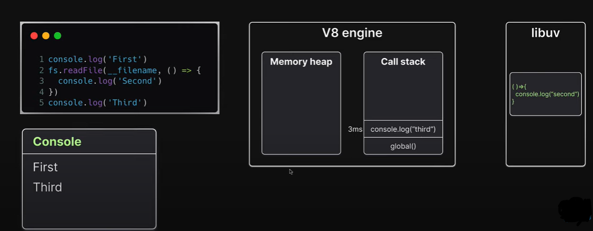
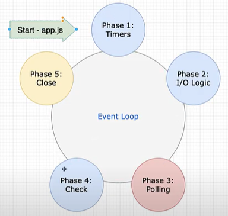

The event loop allows Node.js to perform non-blocking I/O operations — despite the fact that JavaScript is single-threaded — by offloading operations to the system kernel whenever possible.

## Prerequisites

**Synchronous programming**

Synchronous programming refers to the execution of code in the stated order. In a synchronous programme, the subsequent line of code  won't be performed until after a function has been called and returned a value.


**Asynchronous programming**

Asynchronous programming refers to the code that doesn't execute in order. These functions are performed not according to the sequence they are defined inside a code but only when certain conditions are met.

## How code run inside Node.js 



Here in the code the first and fifth statement is synchronous code while the file read operation is a asynchronous code. In Node.js synchronous code runs first hence it will move to the Call Stack and give the output of console statements . But the async file read opeation will move to libuv librarary which in turn move it to the Event Loop, as event loop handles all the asynchronous operations. After that whenever call stack get empty, the Event Loop pass the callback to the call stack for execution. 

How event loop handles asynchronous oparations/code



There are five different phases in an Event Loop and every phase has its own callback queue to handle asynchronous operations but before each phase there's two more microtask callback queues which gets executed. These are process.nextTick() and Promise microtask callback queue. Among these two queues process.nextTick is given a priority. 

Execution Order of code in Event Loop

1. In the initial step process.nextTick() microtask callback queues and Promise microtask callback queue will be executed completely.

2. Timers phase - It will execute and handles setTimeout() and setInterval() callback inside an event loop.

3. process.nextTick() microtask callback queues and Promise microtask callback queue will be executed completely.

4. Input/Output Logic phase - It will execute all the input output related calls , database calls and third party API's calls.

5. process.nextTick() microtask callback queues and Promise microtask callback queue will be executed completely.

6. Polling phase - In this phase it handles all the incoming requests.

7. process.nextTick() microtask callback queues and Promise microtask callback queue will be executed completely.

8. Check phase - In check phase it will execute and handles setImmediate() callback inside an event loop.

9. process.nextTick() microtask callback queues and Promise microtask callback queue will be executed completely.

10. close phase - It will execute all the closing operations like process.exit().

If there are more callbacks to be processed, the loop is kept alive for more runs and the same steps are repeated.

## How asynchronous functions are handled in an event loop 

**setTimeout()**

```js
console.log('first'); //sync code execute first

setTimeout(()=>{// async event loop phase 1 timers code
    console.log('second'); 
},0);

console.log("third"); //sync code execute first
```
**Output**


Firstly it will execute synchronous code inside callstack and prints the synchronous console logs i.e "first" and "third". After that it will move asynchronous function setTimeout() in event loop and will be handled inside the timer phase. On first iteration of event loop it will create a callback of setTimeout() function and on second iteration it will pass the callback inside the call stack for execution and print the console statement.

**setImmediate()**
```js
const ms = 10;// when set ms is zero the order for timeout1, timeout2,immdiate 1 may be in some random order due to slow initializaion in event loop when it code from sync code part  
console.log('first'); //sync code execute first

setImmediate(()=>{console.log('immediate 1')}); //async event loop phase 4 check code
setTimeout(()=>{console.log('time-out 1')},ms); //async event loop phase 1 timers code

setTimeout(()=>{
    console.log('time-out 2')
    setTimeout(()=>{console.log('time-out 3')},ms);
    setImmediate(()=>{console.log('immediate 2')});
},ms);

console.log("second"); //sync code execute first
```
**Output**


Firstly it will execute synchronous code inside callstack and prints the synchronous console logs i.e "first" and "second". After that it will move asynchronous function setTimeout() and setImmediate() inside event loop and will be handled in the timer phase and check phase respectively.  On first iteration of event loop it will create a callback of both setTimeout() functions in timer phase and move to check phase to create a callback of setImmediate() function. On second iteration, since the setTimeout() callback time is not yet completed it will move to the check phase and will pass the callback inside the call stack for execution and print the console statement "immediate 1" and after the setTimeout() time is completed it will execute their callback's and print out the statement "time-out 1"  "time-out 2" and the process will repeat for nested code.

**nextTick()**
```js
const ms = 10;
console.log('first'); //sync code execute first

setImmediate(()=>{console.log('immediate 1')}); //async event loop phase 4 check code
setTimeout(()=>{console.log('time-out 1')},ms); //async event loop phase 1 timers code

setTimeout(()=>{
    console.log('time-out 2')
    setTimeout(()=>{console.log('time-out 3')},ms);
    setImmediate(()=>{console.log('immediate 2')});
},ms);

process.nextTick(()=>{//async event loop microtask code runns in every phase
    process.nextTick(()=>{console.log('nexttick -2');});//async event loop microtask code runns in every phase
    console.log('nexttick -1');
});

console.log("second"); //sync code execute first
```
**Output**


Firstly it will execute synchronous code inside callstack and prints the synchronous console logs i.e "first" and "second". It will then execute the process.nextick() inside microtask callback queue and pass the callback inside the call stack for execution and print the console statement. After that it will execute nested process.nextick() as it has higher priority. Then it will proceed for setTimeout() and setImmediate() functions.The process for these continues as explained earlier.

**Promise()**
```js
const ms = 10;
console.log('naman'); //sync code execute first

setImmediate(()=>{
    console.log('immediate 1');
    process.nextTick(()=>{console.log('nexttick -2')});
}); //async event loop phase 4 check code

setTimeout(()=>{
    console.log('time-out 1')
    Promise.resolve().then(()=>{console.log("promise 2")});
    setTimeout(()=>{console.log('time-out 3')},ms);
    setImmediate(()=>{console.log('immediate 2')});
    process.nextTick(()=>{console.log('nexttick -3')});
},ms);

Promise.resolve().then(()=>{console.log("promise 1")});
process.nextTick(()=>{console.log('nexttick -1');});//async event loop microtask code runns in every phase

console.log("agarwal"); //sync code execute first
```
**Output**


Firstly the synchronous code inside callstack is executed and synchronous console logs i.e "first" and "second" statement are printed. Since process.nextTick() is having a higher priority than Promise so it will pass its callback inside the call stack for execution and print the console statement "nexttick -1". Then the callback of Promise will execute and for setTimeout() and setImmediate() functions the process continues as explained earlier.


## Conclusion

In this article, you learned how Event Loop handles the asynchronous code and the execution of different asynchronous functions.

That’s all! hope you enjoyed reading this article. Do share this article if you find it useful.