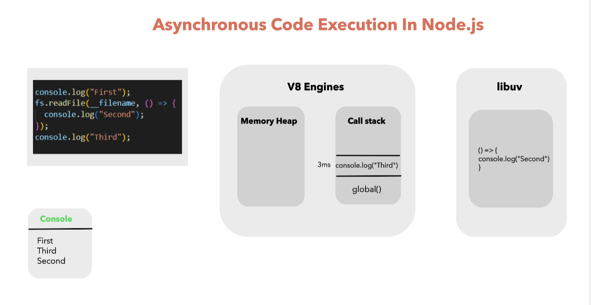
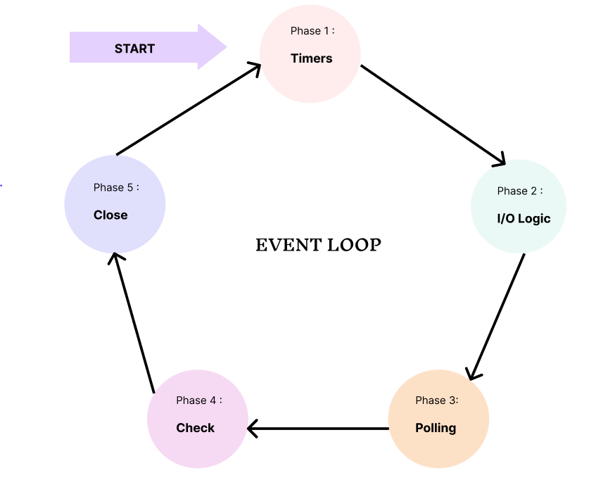
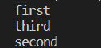
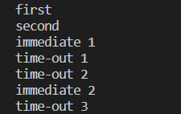
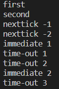
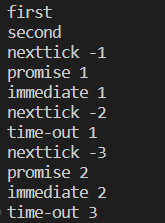

Despite JavaScript being a single-threaded language, the event loop in Node.js gives a provision to handle non-blocking I/O operations by offloading asynchronous operations to the call stack whenever possible.

## Prerequisites

### Synchronous Programming
Synchronous programming refers to the execution of code in the stated order. In a synchronous program, the subsequent line of code won't execute until a function has been called and returned a value.

### Asynchronous programming
Asynchronous programming refers to the code that doesn't execute in order. These functions are not performed according to the defined sequence but only when certain conditions are met.

## How Code Runs Inside Node.js 



The first and fifth statements in the code are synchronous, while the file read operation is asynchronous.

In Node.js, synchronous code runs first; hence it will move to the Call Stack and give the output of console statements.

But the async file read operation will move to the `libuv` library, which moves it to the event loop, as the event loop handles all the asynchronous operations.

After that, whenever the call stack gets empty, the event loop passes the callback to the call stack for execution. 

### How does Event Loop Handles Asynchronous Operations/Code?



There are five phases in an event loop, and every phase has its callback queue to handle asynchronous operations.

But before each phase, two more microtask callback queues get executed. These are `process.nextTick()` and Promise microtask callback queue. Among these two queues, `process.nextTick` is given priority. 

### Execution Order of Code in an Event Loop

1. In the initial step, `process.nextTick()` microtask callback queues and Promise microtask callback queues will be executed completely.

2. Timers phase — It executes and handles `setTimeout()` and `setInterval()` callback inside an event loop.

3. `process.nextTick()` microtask callback queues and Promise microtask callback queue will be executed completely.

4. Input/Output Logic phase will execute all input output-related calls, database calls, and third-party API calls.

5. `process.nextTick()` microtask callback queues and Promise microtask callback queue will be executed completely.

6. Polling phase — It handles all the incoming requests in this phase.

7. `process.nextTick()` microtask callback queues and Promise microtask callback queue will be executed completely.

8. Check phase — In the check phase, it executes and handles the `setImmediate()` callback inside an event loop.

9. `process.nextTick()` microtask callback queues and Promise microtask callback queue will be executed completely.

10. Close phase — It will execute all the closing operations like `process.exit()`.

If there are more callbacks to be processed, the loop is kept alive for more runs, and the same steps are repeated.

## How Asynchronous Functions are Handled in an Event Loop? 

### `setTimeout()`

```js
console.log('first'); //sync code execute first

setTimeout(()=>{// async event loop phase 1 timers code
    console.log('second'); 
},0);

console.log("third"); //sync code execute first
```

#### Output



Firstly, it executes synchronous code inside the call stack and prints the synchronous console logs, i.e., "first" and "third".

After that, it moves the asynchronous function `setTimeout()` in the event loop and will be handled inside the timer phase.

In the first iteration of the event loop, it creates a callback of the `setTimeout()` function. In the second iteration, it passes the callback inside the call stack for execution and prints the console statement.

### setImmediate()

```js
const ms = 10;// when set ms is zero, the order for timeout1, timeout2, and immediate 1 may be in some random order due to slow initialization in the event loop when it comes from the sync code part  
console.log('first'); //sync code execute first

setImmediate(()=>{console.log('immediate 1')}); //async event loop phase 4 check code
setTimeout(()=>{console.log('time-out 1')},ms); //async event loop phase 1 timers code

setTimeout(()=>{
    console.log('time-out 2')
    setTimeout(()=>{console.log('time-out 3')},ms);
    setImmediate(()=>{console.log('immediate 2')});
},ms);

console.log("second"); //sync code execute first
```

#### Output



Firstly, it executes synchronous code inside the call stack and prints the synchronous console logs, i.e., "first" and "second".

After that, it moves the asynchronous function `setTimeout()` and `setImmediate()` inside the event loop and will be handled in the timer and check phases, respectively.

In the first iteration of the event loop, it creates a callback of both `setTimeout()` functions in the timer phase and moves to the check phase to create a callback of the `setImmediate()` function.

In the second iteration, since the `setTimeout()` callback time is not yet completed, it moves to the check phase, passes the callback inside the call stack for execution, and prints the console statement "immediate 1".

And after the `setTimeout()` time is completed, it executes their callbacks and prints out the statement "time-out 1", "time-out 2", and the process will repeat for nested code.

#### nextTick()

```js
const ms = 10;
console.log('first'); //sync code execute first

setImmediate(()=>{console.log('immediate 1')}); //async event loop phase 4 check code
setTimeout(()=>{console.log('time-out 1')},ms); //async event loop phase 1 timers code

setTimeout(()=>{
    console.log('time-out 2')
    setTimeout(()=>{console.log('time-out 3')},ms);
    setImmediate(()=>{console.log('immediate 2')});
},ms);

process.nextTick(()=>{//async event loop microtask code runns in every phase
    process.nextTick(()=>{console.log('nexttick -2');});//async event loop microtask code runns in every phase
    console.log('nexttick -1');
});

console.log("second"); //sync code execute first
```

#### Output



Firstly, it executes synchronous code inside the call stack and prints the synchronous console logs, i.e., "first" and "second".

It then executes the `process.nextick()` inside the microtask callback queue, passes the callback inside the call stack for execution, and prints the console statement.

After that, it executes the nested `process.nextick()` as it has a higher priority. Then it proceeds for the `setTimeout()` and `setImmediate()` functions. The process for these continues, as explained earlier.

### Promise()

```js
const ms = 10;
console.log('naman'); //sync code execute first

setImmediate(()=>{
    console.log('immediate 1');
    process.nextTick(()=>{console.log('nexttick -2')});
}); //async event loop phase 4 check code

setTimeout(()=>{
    console.log('time-out 1')
    Promise.resolve().then(()=>{console.log("promise 2")});
    setTimeout(()=>{console.log('time-out 3')},ms);
    setImmediate(()=>{console.log('immediate 2')});
    process.nextTick(()=>{console.log('nexttick -3')});
},ms);

Promise.resolve().then(()=>{console.log("promise 1")});
process.nextTick(()=>{console.log('nexttick -1');});//async event loop microtask code runns in every phase

console.log("agarwal"); //sync code execute first
```

#### Output



The synchronous code inside the call stack is executed, and synchronous console logs, i.e., "first" and "second" statements, are printed.

Since `process.nextTick()` has a higher priority than Promise, it passes its callback inside the call stack for execution and prints the console statement "nexttick -1".

Then the callback of Promise executes. The process continues as explained earlier for the `setTimeout()` and `setImmediate()` functions.

## Conclusion
In this article, you learned how an event loop handles the asynchronous code and the execution of different asynchronous functions.

That’s all! I hope you've enjoyed reading this. Do share if you find this useful.