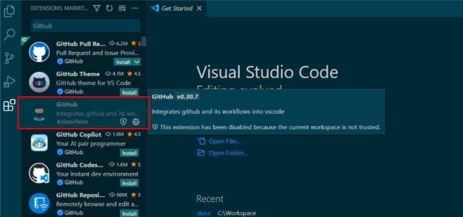
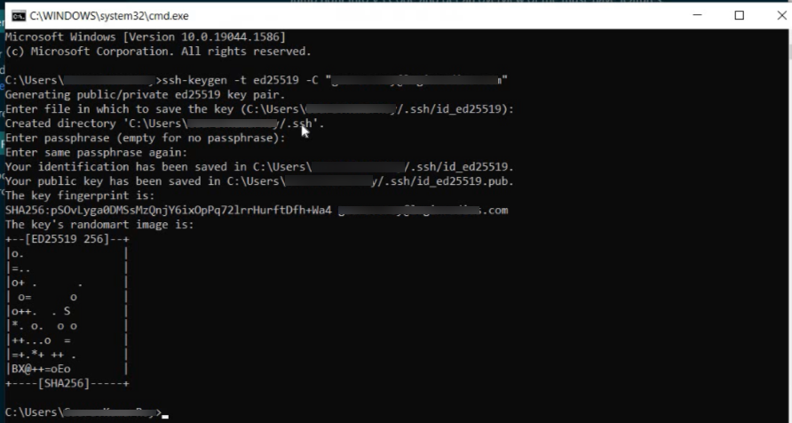
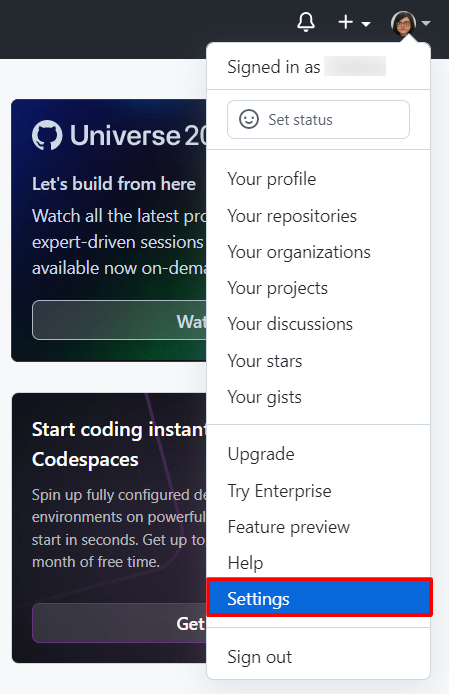
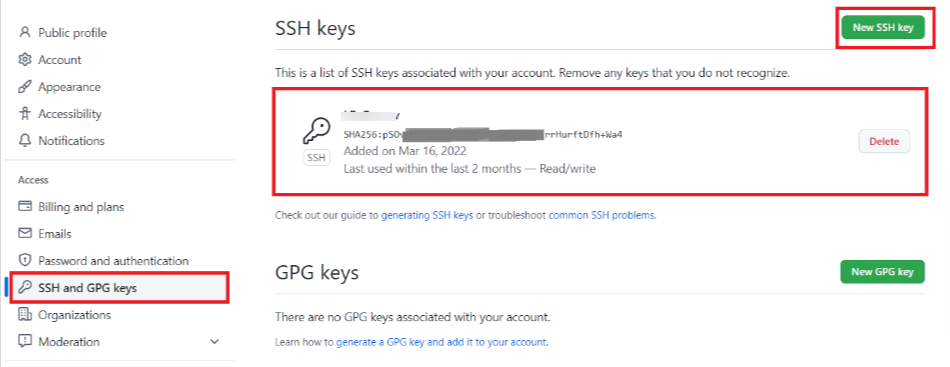
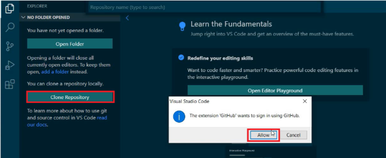
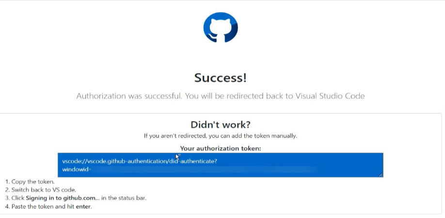
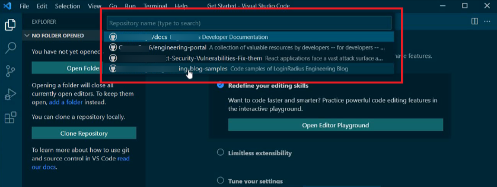
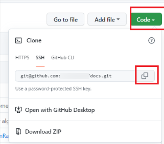
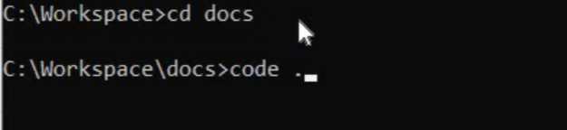

  
The blog has two sections:

- The first section explains [how to download and install both VS Code and Git and then how to integrate Git with VS Code](#download-install-and-integrate-vs-code-and-git)
- The second section explains [how to connect a GitHub account with VS Code and clone the desired repository for making and committing changes to the repository](#connect-with-github-account-and-clone-repository).

## Download, Install, and Integrate VS Code and Git

To create a GitHub Local setup, you need to install Visual Studio Code and Git on your system. Follow these steps to set up your Git locally.
> **Prerequisite:** You must have a GitHub account. Create an [GitHub Account](https://github.com/) if you don’t have it yet.

1. Download VS Code from this link: https://code.visualstudio.com/download and install it in your system.
2. Download Git from this link: https://git-scm.com/downloads and install it in your system.
3. Open VS Code and go to the Extensions from the leftmost pane (Ctrl+Shift+X) and search for the GitHub extension to integrate the GitHub extension with VS Code.

   


## Connect with GitHub Account and Clone Repository

1. Open the command prompt and type the command:
                                                                               
   ```
   ssh-keygen -t ed25519 -C “your_emailId_here”
   ```

   > **Note:** your_emailId_here should be the one from the GitHub account.

2. Press `Enter` 3 times from your keyboard. 

   

3. Now go to `C:/drive>Users>Your System Name>.ssh>id_ed25519.pub` and copy the SSH key from here.

4. Open your GitHub account, where you are already signed in, and go to **Settings**:

   

   The profile screen will appear.

5. Click the **SSH and GPG Keys** option from the left navigation bar.

6. Click the **New SSH Key** from the appeared screen, enter the desired title, select **Authentication Key** from the Key type drop-down, paste the already copied SSH key value in the Key textbox and click the **Add SSH Key** button.

   

   > **Note:**  It can take time to load the page. Also, it might ask you to re-authenticate yourself on GitHub by entering the account password again.

7. Now go back to the command prompt and type:

   ```
   ssh -T git@github.com
   ```

8. Type **Yes** and press **Enter** from the keyboard to this question - whether you want to continue connecting.

9. Now, from VS Code Explorer, click the  **Clone Repository** button and then click **Clone from GitHub**.

10. From the appeared pop-up, click the **Allow** button:

    

11. Another pop-up will appear to ask for your permission (log in) to authorize Visual Studio Code to access the GitHub repository. Click the **Continue** button and enter GitHub’s username & password.

    


12. Now, clone the repository and try looking for your branches and project repository in the search bar of the VS Code. 

    

13. Choose the desired repository, drive, and location. Then create a folder with the name (Workspace) of the branch and click the **Select Repository Location** button. 

    It will clone all the data from the GitHub repository to your local drive location.

14. Go back to your GitHub account, select the repository you have just cloned using VS Code, and click the Code > SSH > Copy button to copy/clone the repository.

    

15. Go back to the command prompt and type the following command:

    ```
    git clone <paste the copied URL>
    ```
    
16. Where copied URL is from step 14. Here is an example of copied URL: `git clone git@github.com:user6/docs.git`

    > **Note:**  After successfully cloning, you can see all the files in your local directory.

17. Now type the following commands:
                                                                               
    ```
    > cd <tab>
    ```
    
18. This will display the subdirectories residing within that current directory.
    In my case, there is only a single subdirectory doc, so your command will look like this:
                                                                               
    ```
    > cd docs
    > code .	// code <space> <dot>: for opening VS Code from this present directory location
    ```
    


>**Note:** Now, from the VS Code, you can switch to different branches and make changes to any file. You can also create new files and folders from VS Code. After making all changes, you can stage and commit it.

You are now ready to start making changes from your local machine through VS Code and publishing them to GitHub. 

> **Note:** If you need help making changes and publishing them to GitHub via a local machine, our next article will cover this information, and we will add a link to that article here.
