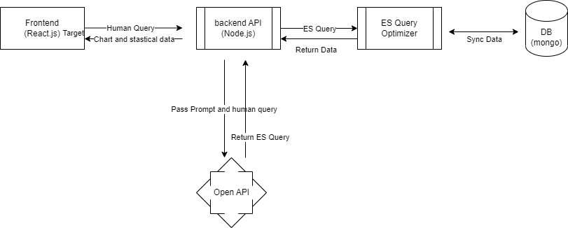
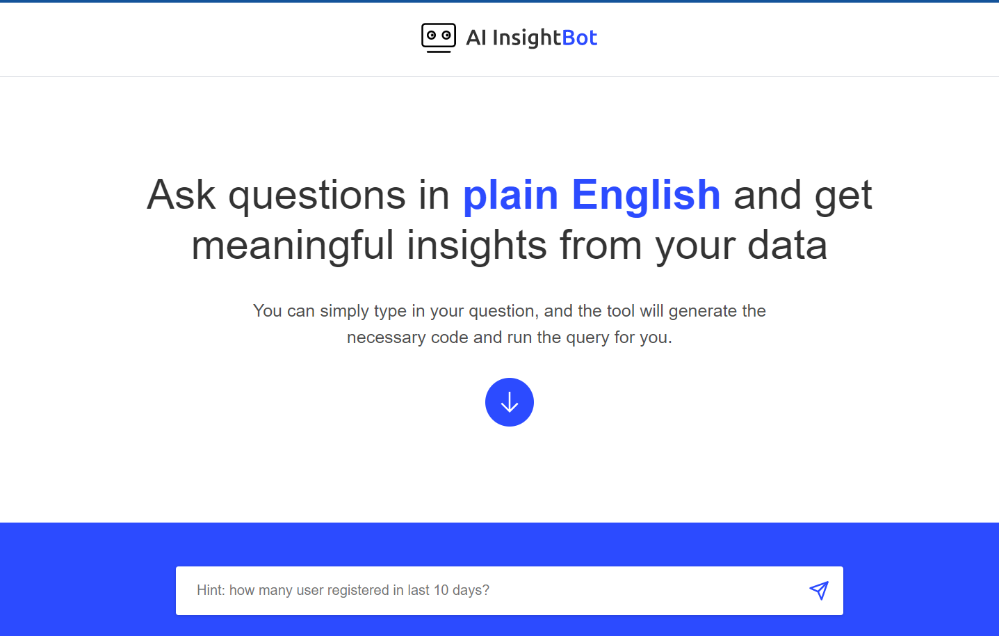

Innovation and collaboration are at the heart of every successful hackathon. Recently, our team had the exciting opportunity to participate in a hackathon focused on artificial intelligence (AI), and we are thrilled to share our journey and the remarkable product we developed: InsightBot.

With the guidance of our esteemed Tech Mentor, Ravi Teja Ghanta, and support from a diverse team of professionals, we embarked on a journey that can revolutionize how businesses harness AI's power.

In this blog, we take you through our hackathon experience, introduce our team, showcase the incredible capabilities of InsightBot, and provide insights into the technical specifications.

## The Birth of InsightBot
Our team brainstormed, ideated, and collaborated throughout the hackathon to develop a groundbreaking solution. Our goal was to leverage AI to provide real-time customer insights and analytics for businesses.

After intense coding sessions, data analysis, and iterative design improvements, InsightBot has resulted from our collective efforts.

## Introducing InsightBot
InsightBot is an AI-powered tool that empowers businesses to gain real-time insights into their customer base.

With its advanced analytics engine and seamless integration with various data sources, InsightBot helps businesses make data-driven decisions, optimize marketing strategies, and enhance customer experiences.

Its interactive dashboard and appealing visualizations make complex data easy to understand and identify key trends and patterns.

## The AI Hackathon Experience
The hackathon served as a platform for like-minded individuals to come together and leverage their skills in artificial intelligence.

Our team was passionate and driven to create a solution that transforms businesses' understanding of their customers. The energy and enthusiasm in the room were palpable as we set out on this exciting endeavor.

## Harnessing the Power of AI
InsightBot harnesses the power of AI to process vast amounts of customer data and extract meaningful insights.

We trained the AI models to analyze customer behavior, preferences, and trends, providing businesses with a comprehensive picture of their target audience.

Integrating AI algorithms allowed for dynamic and adaptive insights, empowering businesses to make data-driven decisions confidently.

## Real-Time Analytics for Actionable Insights
One of the key features of InsightBot is its ability to provide real-time analytics.

Businesses no longer need to rely on outdated reports or manual data analysis.

InsightBot analyzes incoming data streams and presents actionable insights in an intuitive dashboard.

This empowers businesses to adapt quickly to changing market dynamics, identify emerging trends, and make informed decisions on the go.

## Technical Specifications
Our developers meticulously crafted InsightBot with cutting-edge technologies and frameworks.

Here are the technical specifications.

### Architecture 
Here, we explore components, such as API servers, Elasticsearch (ES), and MongoDB, to optimize the retrieval and formatting of data for a visually compelling user experience.

#### Leveraging API Servers
To kickstart the query processing, we pass the human (natural language) query to our API server (Node.js). It is an intermediary facilitating communication between the user and the data retrieval process.

#### Harnessing the Power of Elasticsearch (ES)
Once the query reaches the API server, it is transformed into an ES query.

We ensure the results align with the desired outcome by incorporating the collection prompt.

We have employed the ChatGPT Turbo 3.5 model for this process, but other models can be utilized and fine-tuned to meet specific accuracy requirements.

### Optimization and Data Synchronization
To enhance efficiency, we refine the ES query to extract relevant data. ES seamlessly syncs this data with MongoDB, creating a streamlined approach to handling large datasets.

### Result Formatting
The retrieved data is then formatted into textual statistical data and chart data representations, allowing for appealing information visualization.

The formatted results are passed to the frontend (React), where they are rendered to provide an engaging and intuitive user interface.

### Technologies

**Frontend:** React.js 
**Backend:** Node.js + ES + Mongodb  (you can choose as per your choice)

## Demo
Demo screenshot: 

**Demo URL:** https://ainsightbot.lrhackathon.com/

**Code Repository:** https://github.com/loginradius-hackathon/lr-hackathon-aismartbot

## Team Composition
Our team consisted of talented individuals from various disciplines with unique skills and expertise.

We had:

- Ravi, our esteemed Tech Mentor, provided invaluable guidance and insights throughout the hackathon.

- Azharuddin as Product Manager, who ensured that our product vision aligned with market needs and user requirements.

- Hitesh, as a Designer, crafted a visually appealing and user-friendly interface for InsightBot.

- Abhimanyu, Mohd Modi, and Hemanth, as Developers, worked tirelessly to bring the AI-powered analytics engine of InsightBot to life.

- Sudhey, Kuldeep, and Anupam, as QA Testers, rigorously tested the product to ensure its functionality and reliability.

- Geetika Sharma, as Marketing Manager, strategized and executed effective marketing campaigns to create awareness about InsightBot.

- Yash Rathi as Customer Success Manager, who focused on delivering exceptional customer experiences and ensuring client satisfaction.

We extend our heartfelt gratitude to our strategic mentor Rakesh, the CEO of LoginRadius, for initiating this inspiring hackathon. His visionary leadership and unwavering support empowered us to explore new AI frontiers and create something remarkable.

## Conclusion
Our journey in the hackathon and the successful development of InsightBot exemplify the power of collaboration, innovation, and a shared vision.

Our talented team, led by Ravi as the tech mentor and supported by Azharuddin, Hitesh, Abhimanyu, Modi, Hemanth, Anupam, Sudhey, Kuldeep, Geetika, and Yash Rathi, has showcased their exceptional skills and dedication in bringing this great AI solution to life. 

With InsightBot, the future of customer insights is here, and we can't wait to see the transformative impact it will have on businesses worldwide.