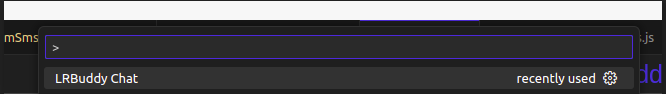
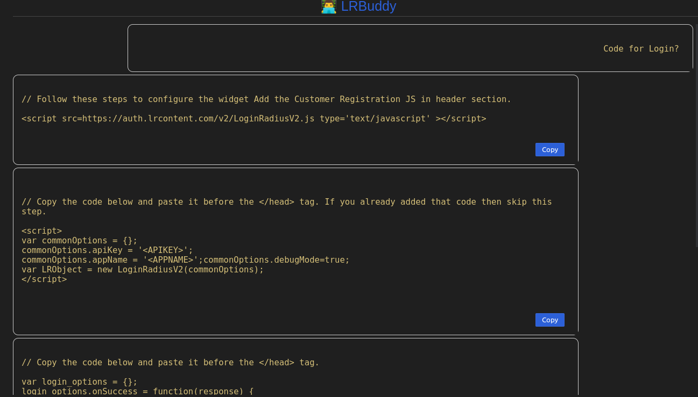

Managing user identity and access is fundamental in building modern applications. The phenomenon has become more important with the rise of cloud computing and mobile devices.

In general, Customer Identity and Access Management (CIAM) solutions provide businesses with the tools to securely and efficiently manage identity processes and workflows, such as user registration, login, password resets, forgotten passwords, and other key functions.

However, implementing a CIAM solution can be complex and time-consuming, especially for developers who need to build these features into their applications from scratch. That's where an AI-powered VS Code extension LRBuddy comes in; it helps streamline the process and makes implementation faster, easier, and more accurate.

## Benefits of the AI-powered VS Code Extension — LRBuddy

An AI-powered VS Code extension can offer several benefits for businesses looking to streamline their CIAM processes:

1. **Efficiency:** It automatically creates snippets for common CIAM processes such as registration, login, and password management, allowing developers to focus more on building other parts of their applications.

2. **Accuracy:** The AI-powered code snippets will be accurate and follow best practices, reducing the risk of errors and vulnerabilities. 

3. **Ease of Use:** The VS Code extension has a user-friendly interface and a simple installation process, making it easy to use and integrate into the workflow.

4. **Flexibility:** The extension provides flexibility and versatility for developers working on various projects. This can help businesses use the extension across their entire development stack.

## Business Use Cases

1. **Rapid Prototyping:** The extension's ability to quickly generate code snippets for CIAM processes can help businesses rapidly prototype new applications and features, reducing the time to market for new products.

2. **Time Savings:** By automating the creation of CIAM code snippets, the VS Code extension can help businesses save time and reduce development costs, freeing up resources for other projects.

3. **Improved Security:** The extension's AI-powered code snippets ensure that generated code follows best practices for reducing the risk of vulnerabilities. This can help businesses protect user data and comply with regulations.

4. **Developer Productivity:** By providing accurate and reliable code snippets for common CIAM processes, the extension can help developers be more productive and efficient, reducing the time spent on repetitive tasks.

5. **Consistency:** The extension can help businesses ensure consistency and uniformity in their CIAM processes across different applications and projects, helping to improve the overall user experience and brand identity.

## How to Run the LRBuddy Extension

1. Install this extension from the marketplace.
2. Open the command palette (Ctrl+Shift+P or Cmd+Shift+P on Mac) and type LRBuddy Chat

3. This opens a new window with a chatbox.

4. Enter the prompt to get a code snippet like "code for login".

## Team

This extension is a result of a hackathon in which the following members worked together:

- Ankit and Pawan developed the extension
- Pawan and Krishna Chikkondra performed QA and verification
- Surendarnath Reddy and Madhu did the Devops tasks related to the backend
- Pawan and Ankit created the presentation and prepared the demo
- Kundan mentored the team 

## Conclusion
The extension is a valuable tool to streamline user identity and access processes. By automating the creation of code snippets, reducing the risk of errors and vulnerabilities, and improving developer productivity, the extension can help businesses save time and resources while enhancing security and consistency across their applications.

> You can access LRBuddy on Visual Studio Marketplace: https://marketplace.visualstudio.com/items?itemName=LRB.lrbuddy